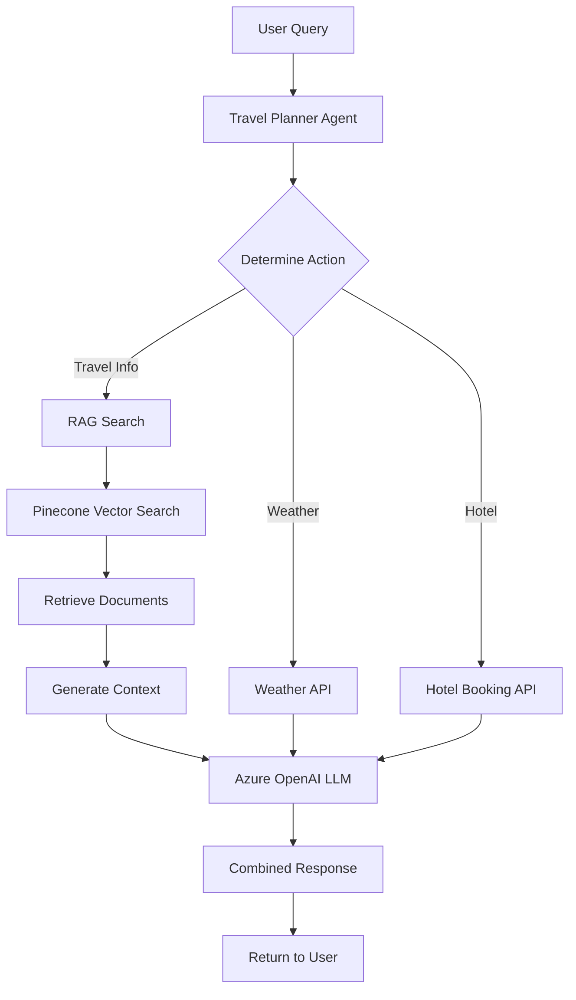

# 🤖 AI Travel Assistant

[](https://www.python.org/downloads/)
[](https://streamlit.io/)
[](https://www.pinecone.io/)
[](LICENSE)
[](https://github.com/Elevate-AI-Room-7/workshop-final/releases)

Trợ lý du lịch thông minh sử dụng **Retrieval-Augmented Generation (RAG)** với Pinecone vector database, tích hợp Weather API và Hotel booking system.

## 👥 Nhóm thực hiện - Nhóm 7
- **ChauDN1** 
- **HuyTN8**
- **ThanhTP4** 
- **TuNNA**
- **HienVT9**

## 🚀 Tính năng chính

### 🤖 Unified Travel Planner Agent
- **RAG System**: Tìm kiếm thông tin du lịch từ cơ sở tri thức vector
- **Weather Integration**: Thông tin thời tiết thời gian thực từ OpenWeatherMap
- **Hotel Booking**: Hệ thống đặt phòng khách sạn (demo)
- **Conversational AI**: Hỗ trợ lập kế hoạch du lịch chi tiết

### 🔍 RAG với Pinecone
- **Vector Similarity Search**: Tìm kiếm semantic với Pinecone cloud database
- **Azure OpenAI Embeddings**: text-embedding-3-small cho độ chính xác cao
- **Smart Context Retrieval**: Lấy thông tin liên quan nhất từ knowledge base

### 🎨 UI/UX
- **Clean Interface**: Giao diện chat đơn giản, tập trung vào trải nghiệm
- **Text-to-Speech**: Chuyển văn bản thành giọng nói tiếng Việt
- **Real-time Chat**: Trò chuyện mượt mà với AI assistant

## 🏗️ Kiến trúc hệ thống

```
📁 workshop-final/
├── 📁 src/                          # Source code chính
│   ├── travel_planner_agent.py      # ✨ Unified Travel Agent
│   ├── pinecone_rag_system.py       # 🔍 RAG System với Pinecone
│   └── utils/
│       └── tts.py                   # 🔊 Text-to-Speech utilities
├── 📁 data/                         # Data directory (empty - managed via Knowledge Base UI)
├── 📁 config/                       # Configuration
│   └── .env.example                 # Environment variables template
├── 📁 scripts/                      # Setup scripts
│   ├── fix_pinecone.bat            # Windows setup script
│   └── fix_pinecone.sh             # Linux/Mac setup script
├── 📁 docs/                        # Documentation
│   ├── project_setup_report.md
│   └── project_restructure_report.md
├── app.py                          # 🚀 Main Streamlit application
├── requirements.txt                # Python dependencies
├── .gitignore                     # Git ignore rules
└── README.md
```

## 🔧 Yêu cầu hệ thống

- **Python**: 3.8 hoặc cao hơn
- **RAM**: Tối thiểu 4GB (8GB khuyên dùng)
- **Storage**: 1GB free space
- **Internet**: Cần thiết cho Pinecone, Azure OpenAI, Weather API

## 📦 Cài đặt

### 1. Clone Repository
```bash
git clone https://github.com/Elevate-AI-Room-7/workshop-final.git
cd workshop-final
```

### 2. Tạo Virtual Environment
```bash
# Tạo virtual environment
python -m venv venv

# Kích hoạt virtual environment
# Windows:
venv\Scripts\activate
# Linux/Mac:
source venv/bin/activate
```

### 3. Cài đặt Dependencies

#### Option 1: Automatic Fix (Recommended)
```bash
# Windows
scripts\fix_pinecone.bat

# Linux/Mac
chmod +x scripts/fix_pinecone.sh
scripts/fix_pinecone.sh
```

#### Option 2: Manual Installation
```bash
# Install dependencies
pip install -r requirements.txt

# Fix potential package conflicts
pip uninstall pinecone-client -y
pip install pinecone>=3.0.0
pip install langchain-community>=0.0.10
```

## 🔑 Cấu hình Environment Variables

Copy file cấu hình mẫu:
```bash
cp config/.env.example .env
```

Chỉnh sửa file `.env` với API keys của bạn:

```env
# Azure OpenAI Configuration
AZURE_OPENAI_API_KEY=your_azure_openai_api_key
AZURE_OPENAI_ENDPOINT=https://your-resource.openai.azure.com/
AZURE_OPENAI_MODEL=GPT-4o-mini

# Azure OpenAI Embeddings Configuration
AZURE_OPENAI_EMBEDDING_API_KEY=your_embedding_api_key
AZURE_OPENAI_EMBEDDING_ENDPOINT=https://your-embedding-resource.openai.azure.com/
AZURE_OPENAI_EMBED_MODEL=text-embedding-3-small

# Weather API (OpenWeatherMap)
WEATHER_API_KEY=your_weather_api_key

# Pinecone Configuration
PINECONE_API_KEY=your_pinecone_api_key
PINECONE_INDEX_NAME=travel-agency
PINECONE_CLOUD=aws
PINECONE_REGION=us-east-1

# TTS Settings
HF_TTS_DEFAULT_LANGUAGE=vietnamese
HF_TTS_AUTO_PLAY=true
HF_TTS_VOLUME=1.0
```

### 🔗 Lấy API Keys:
- **Azure OpenAI**: [Azure Portal](https://portal.azure.com/)
- **Weather API**: [OpenWeatherMap](https://openweathermap.org/api)
- **Pinecone**: [Pinecone Console](https://app.pinecone.io/)

## 🚀 Chạy ứng dụng

```bash
# Đảm bảo virtual environment đã được kích hoạt
streamlit run app.py
```

Truy cập: `http://localhost:8501`

## 🔄 RAG Flow



### Quy trình RAG chi tiết:

1. **Input Processing**: User nhập câu hỏi về du lịch
2. **Agent Analysis**: Travel Planner Agent phân tích intent
3. **Multi-Tool Execution**:
   - **RAG Search**: Tìm kiếm thông tin trong vector database
   - **Weather Tool**: Lấy thông tin thời tiết real-time
   - **Hotel Tool**: Xử lý booking requests
4. **Vector Search**: Pinecone tìm documents liên quan
5. **Context Building**: Kết hợp context từ multiple sources
6. **LLM Generation**: Azure OpenAI GPT-4o-mini sinh response
7. **Response Delivery**: Trả về kết quả tích hợp + TTS

## 🎯 Câu hỏi mẫu

### 🔍 RAG-based Queries:
- "Gợi ý điểm du lịch ở Đà Nẵng"
- "Món ăn đặc sản ở Huế"
- "Lịch trình 3 ngày ở Sapa"
- "Hoạt động vui chơi ở Phú Quốc"

### 🌤️ Weather Queries:
- "Thời tiết Hà Nội hôm nay như thế nào?"
- "Kiểm tra thời tiết Đà Lạt"

### 🏨 Hotel Booking:
- "Đặt khách sạn ở Hội An cho ngày 25/12/2025, 2 đêm"
- "Book hotel in Ho Chi Minh City for 3 nights"

### 🗺️ Travel Planning:
- "Lập kế hoạch du lịch Nha Trang 5 ngày"
- "Tư vấn tour miền Bắc cho gia đình"

## 🚀 Tech Stack

- **Frontend**: Streamlit
- **Vector Database**: Pinecone Cloud
- **LLM**: Azure OpenAI GPT-4o-mini
- **Embeddings**: Azure OpenAI text-embedding-3-small
- **Agent Framework**: LangChain
- **APIs**: OpenWeatherMap
- **TTS**: Google Text-to-Speech (gTTS)

## 🔧 Troubleshooting

### Common Issues:

1. **Pinecone Import Error**:
   ```bash
   pip uninstall pinecone-client -y
   pip install pinecone>=3.0.0
   ```

2. **LangChain Import Error**:
   ```bash
   pip install langchain-community>=0.0.10
   ```

3. **Empty Knowledge Base**:
   - Sử dụng tab "Knowledge Base" để thêm dữ liệu du lịch
   - Không cần file dataset - quản lý trực tiếp qua UI

4. **Environment Variables**:
   - Đảm bảo file `.env` ở root directory
   - Check tất cả API keys đã được set đúng

## 📊 Performance

- **Vector Search**: ~100-200ms (Pinecone cloud latency)
- **LLM Response**: ~1-3s (Azure OpenAI)
- **Weather API**: ~200-500ms
- **Overall Response Time**: 2-5s depending on query complexity

## 🔄 Release History

### v1.0.0 (Latest)
- ✨ Unified Travel Planner Agent architecture
- 🔧 Simplified UI với clean chat interface
- 🚀 Production-ready codebase
- 📚 Comprehensive documentation
- 🔍 Pinecone-only vector database implementation

## 📄 License

MIT License - xem [LICENSE](LICENSE) file.

## 🤝 Contributing

1. Fork the repository
2. Create feature branch (`git checkout -b feature/amazing-feature`)
3. Commit changes (`git commit -m 'Add amazing feature'`)
4. Push to branch (`git push origin feature/amazing-feature`)
5. Open Pull Request

---

🚀 **Happy Travel Planning!** Được phát triển bởi **Nhóm 7** cho Workshop Final.

✨ *Powered by Pinecone, Azure OpenAI & LangChain*