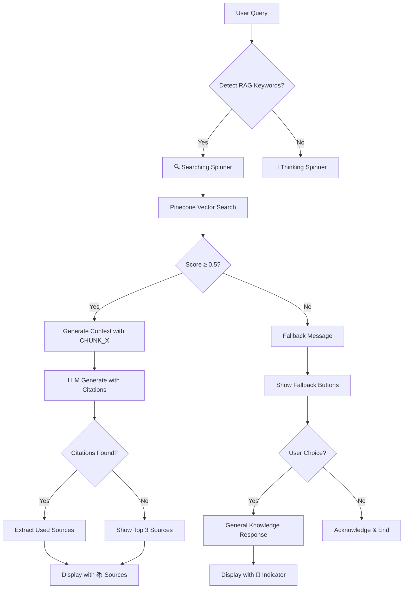

# 📚 RAG System - User Cases & User Stories Documentation

## 📖 Table of Contents
1. [Overview](#overview)
2. [User Personas](#user-personas)
3. [User Cases](#user-cases)
4. [User Stories](#user-stories)
5. [Technical Flow](#technical-flow)
6. [Success Metrics](#success-metrics)
7. [Edge Cases](#edge-cases)

---

## 🎯 Overview

RAG (Retrieval-Augmented Generation) System trong AI Travel Assistant cho phép người dùng truy vấn thông tin du lịch từ cơ sở dữ liệu vector Pinecone và nhận được câu trả lời chính xác với source citations.

### Key Features:
- **Smart Source Tracking**: Chỉ hiển thị sources thực sự được LLM sử dụng
- **Relevance Filtering**: Filter chunks với score ≥ 0.5
- **Fallback System**: General knowledge khi không có thông tin relevant
- **Interactive UX**: User có thể chọn fallback options

---

## 👥 User Personas

### 1. **Tourist (Du khách)**
- **Profile**: Người muốn tìm thông tin du lịch cụ thể
- **Goals**: Tìm điểm tham quan, nhà hàng, lịch trình
- **Tech Level**: Basic to Intermediate

### 2. **Travel Planner (Người lập kế hoạch)**
- **Profile**: Chuyên viên du lịch hoặc người có kinh nghiệm
- **Goals**: Thông tin chi tiết, so sánh options, verify sources
- **Tech Level**: Intermediate to Advanced

### 3. **Content Creator (Người tạo nội dung)**
- **Profile**: Blogger, reviewer, travel influencer
- **Goals**: Thông tin unique, sources đáng tin cậy
- **Tech Level**: Advanced

---

## 🎮 User Cases

### **UC01: Tìm kiếm thông tin có trong Knowledge Base**

**Actor**: Tourist
**Precondition**: Knowledge Base có dữ liệu relevant
**Main Flow**:
1. User nhập query: "Gợi ý địa điểm tham quan ở Hà Nội"
2. System detect RAG keywords → hiển thị "🔍 Đang tìm kiếm..."
3. Pinecone search tìm relevant chunks (score ≥ 0.5)
4. LLM generate response với [CHUNK_X] citations
5. System extract sources từ citations
6. Display response với sources: `📚 Sources: hanoi-001, temple-guide-02 +1`

**Postcondition**: User nhận được thông tin chính xác với sources

---

### **UC02: Không tìm thấy thông tin relevant**

**Actor**: Tourist
**Precondition**: Knowledge Base không có dữ liệu về query
**Main Flow**:
1. User nhập query: "Du lịch sao Hỏa có gì hay?"
2. System search nhưng không có chunks với score ≥ 0.5
3. System hiển thị fallback message:
   ```
   Tôi không tìm thấy thông tin về **du lịch sao Hỏa** trong cơ sở dữ liệu. 
   Bạn có muốn tôi trả lời dựa trên kiến thức chung không?
   ```
4. User click "✅ Có, hãy trả lời"
5. System generate response từ general knowledge
6. Display với indicator: `🧠 Trả lời dựa trên kiến thức chung`

**Alternative Flow**: User click "❌ Không cần" → System acknowledge

---

### **UC03: Mixed Query (RAG + Tools)**

**Actor**: Travel Planner
**Precondition**: Query cần cả RAG và external tools
**Main Flow**:
1. User nhập: "Thời tiết Đà Nẵng hôm nay và gợi ý địa điểm tham quan"
2. System detect cả weather và travel keywords
3. Agent sử dụng cả Weather tool và RAG search
4. Response combine weather data + RAG information
5. Display sources chỉ cho phần RAG: `📚 Sources: danang-attractions-01`

---

### **UC04: Source Verification**

**Actor**: Content Creator
**Precondition**: User cần verify thông tin
**Main Flow**:
1. User nhập query cụ thể: "Giá vé tham quan Vịnh Hạ Long"
2. RAG system tìm relevant chunks
3. LLM cite specific chunks có thông tin giá
4. Display precise sources: `📚 Sources: halong-pricing-2024`
5. User có thể trace back thông tin từ source ID

---

## 📝 User Stories

### **Epic 1: Information Retrieval**

#### **US1.1: As a tourist, I want to get travel information with sources**
```
Given I am planning a trip
When I ask "Món ăn đặc sản Huế nổi tiếng"
Then I should receive detailed information about Huế cuisine
And I should see the sources where this information came from
So that I can trust the accuracy of the information
```

**Acceptance Criteria**:
- [ ] Query được detect như RAG query
- [ ] Hiển thị spinner "🔍 Đang tìm kiếm..."
- [ ] Response chứa thông tin về món ăn Huế
- [ ] Sources hiển thị format: `📚 Sources: hue-food-01, imperial-cuisine-03`
- [ ] Sources limit 3 items với +N indicator nếu có nhiều hơn

#### **US1.2: As a user, I want fallback options when no relevant info found**
```
Given I ask about something not in the knowledge base
When I query "Du lịch Châu Âu có gì hay?"
Then I should see a fallback message
And I should have options to get general knowledge response
So that I still get helpful information
```

**Acceptance Criteria**:
- [ ] Fallback message hiển thị với query được highlight
- [ ] 2 buttons: "✅ Có, hãy trả lời" và "❌ Không cần"
- [ ] Click "Có" → general knowledge response với 🧠 indicator
- [ ] Click "Không" → polite acknowledgment

### **Epic 2: Source Accuracy**

#### **US2.1: As a content creator, I want to see only actually used sources**
```
Given I need accurate source attribution
When I ask a detailed question that matches multiple chunks
Then I should only see sources that were actually used in the response
And not all retrieved sources
So that I can properly cite my information
```

**Acceptance Criteria**:
- [ ] LLM citations [CHUNK_X] được extract correctly
- [ ] Chỉ sources được cite mới hiển thị
- [ ] Fallback show top 3 nếu không có citations
- [ ] Debug logging track chunk usage

#### **US2.2: As a travel planner, I want to understand source relevance**
```
Given I'm researching travel options
When I ask about specific destinations
Then I should see how relevant the sources are
And understand the quality of information
So that I can make informed decisions
```

**Acceptance Criteria**:
- [ ] Sources được filter với relevance score ≥ 0.5
- [ ] High-quality sources được prioritize
- [ ] Sources display format clear và readable

### **Epic 3: User Experience**

#### **US3.1: As a user, I want visual feedback for different response types**
```
Given I'm interacting with the system
When I receive different types of responses
Then I should clearly understand the source of information
And the system should provide appropriate visual indicators
So that I know how to interpret the response
```

**Acceptance Criteria**:
- [ ] RAG responses: `📚 Sources: ...`
- [ ] General knowledge: `🧠 Trả lời dựa trên kiến thức chung`
- [ ] Weather/Tools: Không có source indicator
- [ ] Error states: Clear error messages

#### **US3.2: As a user, I want intuitive interaction with fallback options**
```
Given the system cannot find relevant information
When I'm presented with fallback options
Then the interface should be clear and easy to use
And I should understand what each option does
So that I can make the right choice for my needs
```

**Acceptance Criteria**:
- [ ] Fallback buttons có clear labels
- [ ] Button styling consistent với UI
- [ ] Response immediate sau khi click
- [ ] No confusion về options

---

## 🔧 Technical Flow

### **RAG Pipeline Flow**


### **Source Tracking Algorithm**
```python
def track_sources(llm_response, chunk_mapping):
    # Extract [CHUNK_X] references
    citations = re.findall(r'\[CHUNK_(\d+)\]', llm_response)
    
    # Map to actual source IDs
    used_sources = []
    for chunk_num in citations:
        chunk_id = f"CHUNK_{chunk_num}"
        if chunk_id in chunk_mapping:
            used_sources.append(chunk_mapping[chunk_id])
    
    # Fallback if no citations
    if not used_sources and relevant_docs:
        used_sources = [doc["id"] for doc in relevant_docs[:3]]
    
    return used_sources
```

---

## 📊 Success Metrics

### **Quantitative Metrics**
- **Source Accuracy**: 95% của displayed sources được sử dụng thực tế
- **Relevance Rate**: 85% queries có ít nhất 1 chunk với score ≥ 0.5
- **Fallback Usage**: <20% queries trigger fallback system
- **User Satisfaction**: 90% users choose "Có" khi offered fallback

### **Qualitative Metrics**
- User feedback về source trustworthiness
- Content creator satisfaction với source attribution
- Tourist confidence trong travel information

---

## ⚠️ Edge Cases

### **EC1: Empty Knowledge Base**
**Scenario**: Pinecone index có 0 vectors
**Expected**: Mọi queries đều trigger fallback system
**Handling**: Clear message về empty knowledge base

### **EC2: LLM Không Tuân Thủ Citation Format**
**Scenario**: LLM không sử dụng [CHUNK_X] format
**Expected**: Fallback hiển thị top 3 sources
**Handling**: Robust regex parsing + fallback mechanism

### **EC3: Very Low Relevance Scores**
**Scenario**: Tất cả chunks có score < 0.5
**Expected**: Trigger fallback system
**Handling**: Threshold adjustment hoặc expand knowledge base

### **EC4: Mixed Language Queries**
**Scenario**: User query bằng English cho Vietnamese knowledge base
**Expected**: Cross-language search hoặc fallback
**Handling**: Language detection + appropriate handling

### **EC5: Extremely Long Queries**
**Scenario**: User nhập query > 500 characters
**Expected**: Truncate hoặc summary before processing
**Handling**: Input validation + preprocessing

---

## 🚀 Future Enhancements

### **Phase 2 Features**
- [ ] **Multi-language Support**: English + Vietnamese RAG
- [ ] **Confidence Scoring**: Hiển thị confidence level cho responses
- [ ] **Source Preview**: Hover để xem snippet từ source
- [ ] **User Feedback**: Thumbs up/down cho source quality

### **Phase 3 Features**
- [ ] **Personalized RAG**: User preferences affect source ranking
- [ ] **Real-time Updates**: Knowledge base auto-update
- [ ] **Advanced Analytics**: Source usage analytics
- [ ] **API Integration**: External travel data sources

---

## 📋 Testing Scenarios

### **Test Case 1: Happy Path RAG**
```
Input: "Địa điểm tham quan nổi tiếng ở Hội An"
Expected Output:
- Spinner: "🔍 Đang tìm kiếm..."
- Response về Hội An attractions
- Sources: `📚 Sources: hoian-attractions-01, ancient-town-guide +1`
```

### **Test Case 2: Fallback Flow**
```
Input: "Du lịch không gian vũ trụ"
Expected Output:
- Fallback message với buttons
- General knowledge response nếu user chọn "Có"
- 🧠 indicator cho general knowledge
```

### **Test Case 3: Source Accuracy**
```
Input: Specific query matching 5 chunks
Expected: Chỉ sources thực sự được LLM cite
Verify: Check logs for chunk citations tracking
```

---

**Document Version**: 1.0  
**Last Updated**: December 2024  
**Authors**: AI Development Team  
**Status**: Active Development  

---

*Tài liệu này sẽ được cập nhật theo sự phát triển của RAG system và feedback từ users.*