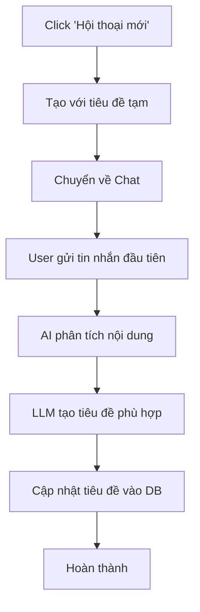
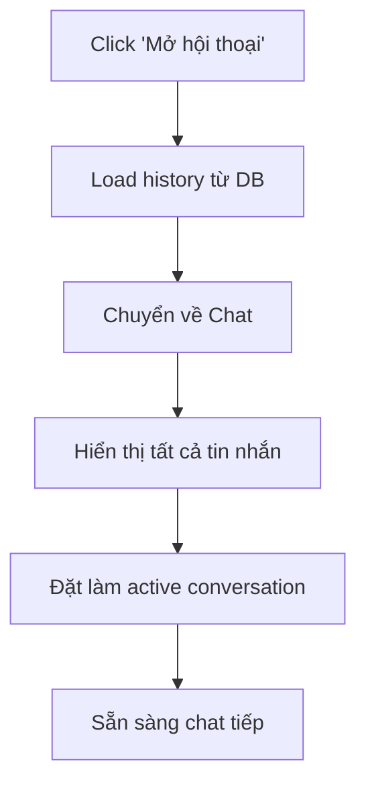

# 📜 Hướng dẫn Lịch sử Hội thoại

## 🎯 Tổng quan

Tính năng **Lịch sử hội thoại** cho phép bạn quản lý toàn bộ cuộc hội thoại với AI Travel Assistant, bao gồm tạo mới, xem chi tiết, chuyển đổi giữa các hội thoại và tự động đặt tên thông minh.

## ✨ Tính năng chính

### 📋 **Quản lý Hội thoại**
- ✅ Xem danh sách tất cả hội thoại với thông tin chi tiết
- ✅ Tạo hội thoại mới với 1 click
- ✅ Chuyển đổi nhanh giữa các hội thoại
- ✅ Xóa hội thoại không cần thiết
- ✅ Tìm kiếm hội thoại theo tiêu đề

### 🤖 **Tự động đặt tên với LLM**
- ✅ AI tự động tạo tiêu đề dựa trên tin nhắn đầu tiên
- ✅ Tiêu đề ngắn gọn, súc tích, phù hợp với nội dung
- ✅ Hỗ trợ fallback nếu LLM không hoạt động
- ✅ Cập nhật real-time vào database

### 🔍 **Tìm kiếm & Lọc**
- ✅ Tìm kiếm theo từ khóa trong tiêu đề
- ✅ Lọc theo thời gian (hôm nay, 7 ngày, 30 ngày, 90 ngày)
- ✅ Sắp xếp theo thời gian cập nhật mới nhất
- ✅ Hiển thị thống kê tổng quan

## 📱 Cách sử dụng

### 🚀 **Truy cập Lịch sử Hội thoại**

1. Mở AI Travel Assistant
2. Trong menu bên trái, chọn **"📜 Lịch sử hội thoại"**
3. Trang lịch sử sẽ hiển thị với đầy đủ tính năng

### ➕ **Tạo Hội thoại Mới**

1. Click button **"🆕 Hội thoại mới"** (màu xanh)
2. Hệ thống tự động tạo hội thoại với tiêu đề tạm thời
3. Bạn sẽ được chuyển về trang Chat
4. Khi gửi tin nhắn đầu tiên, AI sẽ tự động đặt tên cho hội thoại

**Ví dụ Auto-naming:**
```
👤 User: "Tôi muốn đi du lịch Đà Nẵng"
🤖 System: Đặt tên -> "Du lịch Đà Nẵng"

👤 User: "Thời tiết Hà Nội hôm nay thế nào?"  
🤖 System: Đặt tên -> "Thời tiết Hà Nội"

👤 User: "Đặt khách sạn ở Sapa"
🤖 System: Đặt tên -> "Đặt khách sạn Sapa"
```

### 💬 **Mở Hội thoại Cũ**

1. Trong danh sách hội thoại, tìm hội thoại muốn mở
2. Click button **"💬 Mở hội thoại"**
3. Hệ thống sẽ:
   - Load toàn bộ lịch sử chat
   - Chuyển về trang Chat
   - Hiển thị tất cả tin nhắn trước đó
   - Đặt hội thoại làm "active"

### 🔍 **Tìm kiếm Hội thoại**

1. Mở section **"🔍 Tìm kiếm & Lọc"**
2. **Tìm kiếm theo từ khóa:**
   - Nhập từ khóa vào ô "Tìm kiếm theo tiêu đề"
   - Hệ thống lọc real-time
3. **Lọc theo thời gian:**
   - Chọn "Hôm nay", "7 ngày qua", "30 ngày qua", hoặc "90 ngày qua"
   - Kết hợp được với tìm kiếm từ khóa

### 📋 **Xem Chi tiết Hội thoại**

1. Click button **"📋 Chi tiết"** của hội thoại
2. Hệ thống hiển thị:
   - **Thông tin cơ bản:** Tiêu đề, ID, thời gian tạo/cập nhật
   - **Thống kê:** Tổng số tin nhắn, trạng thái hoạt động
   - **Preview:** 5 tin nhắn gần nhất với nội dung rút gọn

### 🗑️ **Xóa Hội thoại**

1. Click button **"🗑️ Xóa"** của hội thoại
2. Click lần 2 để xác nhận (có cảnh báo)
3. Hội thoại và toàn bộ lịch sử sẽ bị xóa vĩnh viễn

⚠️ **Lưu ý:** Không thể khôi phục sau khi xóa!

## 📊 Hiển thị Thông tin

### 🏷️ **Thẻ Hội thoại**

Mỗi hội thoại hiển thị:

```
🟢 Tiêu đề Hội thoại                    🟢 Đang hoạt động
Preview: Tin nhắn đầu tiên của người dùng...

📝 5 tin nhắn    🕒 2 giờ trước    📅 Tạo: 14/08/2025 15:30
```

**Ý nghĩa màu sắc:**
- **🟢 Xanh lá:** Hội thoại đang hoạt động
- **⚪ Xám:** Hội thoại không hoạt động
- **Viền xanh:** Hội thoại được chọn

### 📈 **Thống kê Tổng quan**

Đầu trang hiển thị:
- **Tổng số hội thoại:** Số lượng hội thoại đã tạo
- **Button làm mới:** Cập nhật danh sách mới nhất
- **Button tạo mới:** Nhanh chóng tạo hội thoại

## 🔄 **Workflow Hoàn chỉnh**

### 📝 **Luồng Tạo Hội thoại Mới**



### 💬 **Luồng Mở Hội thoại Cũ**



## 🤖 **Chi tiết Auto-naming**

### 🧠 **Cách LLM Đặt tên**

**Input:** Tin nhắn đầu tiên của user
**Process:** 
1. Phân tích ý định và chủ đề chính
2. Trích xuất địa điểm, hoạt động quan trọng
3. Tạo tiêu đề 3-8 từ, súc tích
4. Sử dụng tiếng Việt, dễ hiểu

**Output:** Tiêu đề ngắn gọn

### 📝 **Ví dụ Auto-naming**

| Tin nhắn User | Tiêu đề được tạo |
|---------------|------------------|
| "Xin chào, tôi muốn đi du lịch Đà Nẵng 3 ngày" | "Du lịch Đà Nẵng" |
| "Kiểm tra thời tiết Hà Nội hôm nay" | "Thời tiết Hà Nội" |
| "Giúp tôi đặt khách sạn ở Sapa cho ngày 25/12" | "Đặt khách sạn Sapa" |
| "Tôi muốn thuê xe từ Hà Nội đi Hạ Long" | "Thuê xe Hà Nội - Hạ Long" |
| "Lên kế hoạch du lịch Phú Quốc" | "Kế hoạch Phú Quốc" |
| "Có gì hay ở Hồ Chí Minh?" | "Khám phá Hồ Chí Minh" |

### 🔄 **Fallback Mechanism**

Nếu LLM không hoạt động:
1. **Keyword detection:** Tìm từ khóa chính
2. **Pattern matching:** Nhận diện mẫu câu
3. **Default naming:** Tiêu đề generic

**Fallback Examples:**
- Chứa "thời tiết" → "Thời tiết"  
- Chứa "đặt" + "khách sạn" → "Đặt khách sạn"
- Chứa tên địa danh → "Du lịch [Địa danh]"
- Mặc định → "Hội thoại du lịch"

## ⚙️ **Cấu hình & Tùy chỉnh**

### 🗄️ **Database Storage**

Tất cả dữ liệu được lưu trong SQLite:
- **conversations:** Thông tin hội thoại
- **conversation_history:** Chi tiết từng tin nhắn
- **Indexes:** Tối ưu hóa truy vấn theo thời gian

### 🔧 **Session State Management**

```python
# Navigation state
st.session_state.selected_page = "📜 Lịch sử hội thoại"

# Conversation state  
st.session_state.active_conversation_id = "uuid-here"
st.session_state.conversation_needs_naming = True

# Chat state
st.session_state.messages = [...] 
st.session_state.chat_history = [...]
```

## 🚨 **Troubleshooting**

### ❓ **Câu hỏi thường gặp**

**Q: Tại sao hội thoại không được đặt tên tự động?**
A: 
- Kiểm tra kết nối internet và API key
- LLM có thể đang bảo trì, sử dụng fallback
- Xem log console để debug

**Q: Làm sao để khôi phục hội thoại đã xóa?**
A: Không thể khôi phục sau khi xóa. Hãy cẩn thận khi xóa.

**Q: Tối đa có thể tạo bao nhiêu hội thoại?**
A: Không giới hạn, nhưng nên dọn dẹp định kỳ để tối ưu hiệu suất.

**Q: Hội thoại có được backup không?**  
A: Tất cả data trong SQLite database có thể backup thủ công.

### 🐛 **Lỗi thường gặp**

**"Không thể tải hội thoại"**
- Kiểm tra file database tồn tại
- Restart ứng dụng
- Xóa cache browser

**"LLM naming thất bại"**
- Sử dụng fallback naming tự động
- Có thể rename thủ công sau
- Kiểm tra Azure OpenAI API key

## 🎯 **Best Practices**

### ✅ **Nên làm**
- Sử dụng từ khóa mô tả rõ ràng trong tin nhắn đầu tiên
- Định kỳ dọn dẹp hội thoại cũ không dùng
- Tận dụng tính năng tìm kiếm khi có nhiều hội thoại
- Backup database định kỳ

### ❌ **Không nên**
- Tạo quá nhiều hội thoại trùng lặp nội dung
- Xóa hội thoại quan trọng mà chưa backup
- Dựa hoàn toàn vào auto-naming, có thể cần chỉnh sửa
- Bỏ qua việc dọn dẹp hội thoại cũ

## 📞 **Hỗ trợ**

Nếu gặp vấn đề:
1. Kiểm tra logs trong console
2. Restart ứng dụng  
3. Kiểm tra database file: `data/travel_assistant.db`
4. Báo lỗi với thông tin chi tiết

---

## 🎉 **Tính năng được hỗ trợ**

✅ **Đã hoàn thành:**
- Tạo/xóa hội thoại
- Auto-naming với LLM  
- Tìm kiếm & lọc
- Load/save lịch sử chat
- Navigation giữa các trang
- Database integration
- Error handling & fallback

🔮 **Sắp tới:**
- Rename hội thoại thủ công
- Export/import hội thoại
- Conversation templates
- Search trong nội dung tin nhắn
- Conversation analytics

---

💡 **Tip:** Sử dụng tính năng này để tổ chức các chuyến du lịch khác nhau thành những cuộc hội thoại riêng biệt, giúp bạn dễ dàng quản lý và tham khảo thông tin sau này!